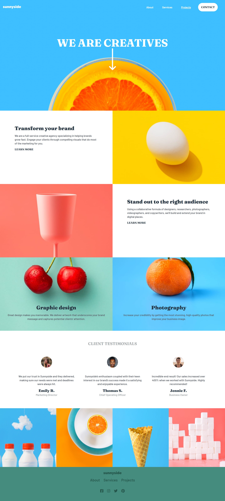

# Frontend Mentor - Sunnyside agency landing page solution

This is a solution to the [Sunnyside agency landing page challenge on Frontend Mentor](https://www.frontendmentor.io/challenges/sunnyside-agency-landing-page-7yVs3B6ef).

## Table of contents

- [Overview](#overview)
  - [The challenge](#the-challenge)
  - [Screenshot](#screenshot)
  - [Links](#links)
- [Built with](#built-with)
- [Author](#author)

## Overview

### The challenge

Users should be able to:

- View the optimal layout for the site depending on their device's screen size
- See hover states for all interactive elements on the page

### Screenshot

### Links

- Solution URL: [Github](https://github.com/sanchezdev-1906/frontendmentor---challenge-8/)
- Live Site URL: [Github Pages](https://sanchezdev-1906.github.io/frontendmentor---challenge-8/)

## Built with

- Semantic HTML5 markup
- Sass
- BEM Methodology
- Flexbox
- CSS Grid
- Mobile-first workflow

## Author

- Website - [joel-development](https://sanchezdev-1906.github.io/)
